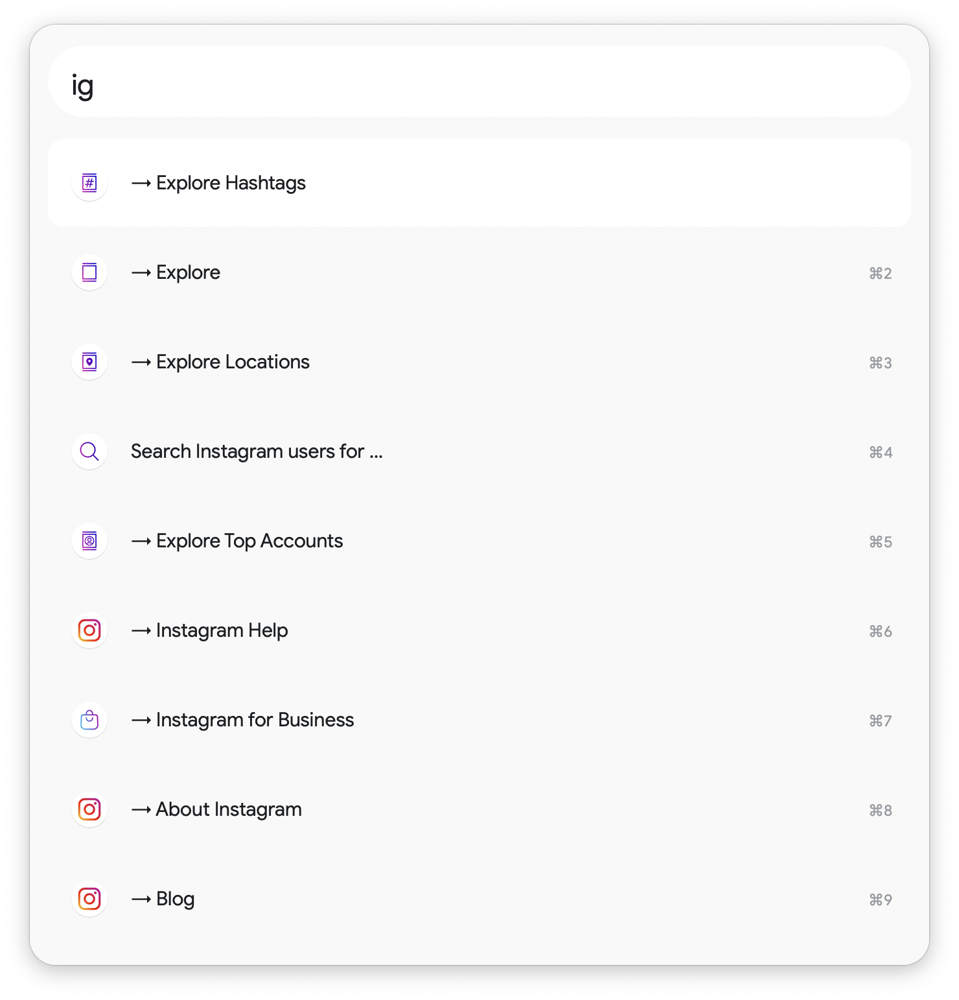

# Instagram Toolkit for Alfred

The Instagram Toolkit for Alfred makes it easy to quickly access Instagram's web features, including messaging and search.

It makes it easy to access different kinds of content and Instagram's settings using the `ig` and `@` keywords:

This workflow doesn't support programmatic access to Instagram, like posting photos directly or sending DMs.

# Installation

1. Download the [latest release here](https://github.com/chrismessina/alfred-instagram-toolkit/releases/latest).
2. Double-click the `.alfredworkflow` to install it.

_You will need to be an [Alfred Powerpack](https://www.alfredapp.com/powerpack/) user to enable this workflow._

# Configuration

Once the workflow is installed, launch **Alfred Preferences**, choose **Workflows** and then select **Instagram Toolkit**.

➊ Access the **Workflow Environment Variables** in the top right of the window:

## Set your username

This workflow makes it easy to access your own profile and different content types.

➋ To configure this feature, you must set the `account` variable in the configuration to *your own username*.

# Changelog[¹](https://keepachangelog.com/)

## [v0.1.2] - 2021-04-19

### Changed
- Replaced photo download service with [IGram](https://igram.io/)

## [v0.1.1] - 2021-02-16

### Changed
- Replaced Imginn with SearchUsers.com for user search (h/t [ProRock](https://www.alfredforum.com/profile/20643-prorock/))

### Fixed
- Fixed Copy to Clipboard value for profile URL

## [v0.1.0] - 2021-01-01
- Initial Release

# About

This workflow is unaffiliated with nor endorsed by Instagram or Facebook, Inc.

You can [file bugs](https://github.com/chrismessina/alfred-instagram-toolkit/issues/new) or [submit feature requests](https://github.com/chrismessina/alfred-instagram-toolkit/issues/new) on GitHub using the label `workflow:instagram-toolkit`.

Thanks to [A. Nathaniel](https://instagram.com/sozonome) for adding URL support to [InstaDLD](https://instadld.sznm.dev/).

<a href="https://www.alfredforum.com/topic/16387-workflow-instagram-toolkit-for-alfred/">Alfred Forum link</a>.
